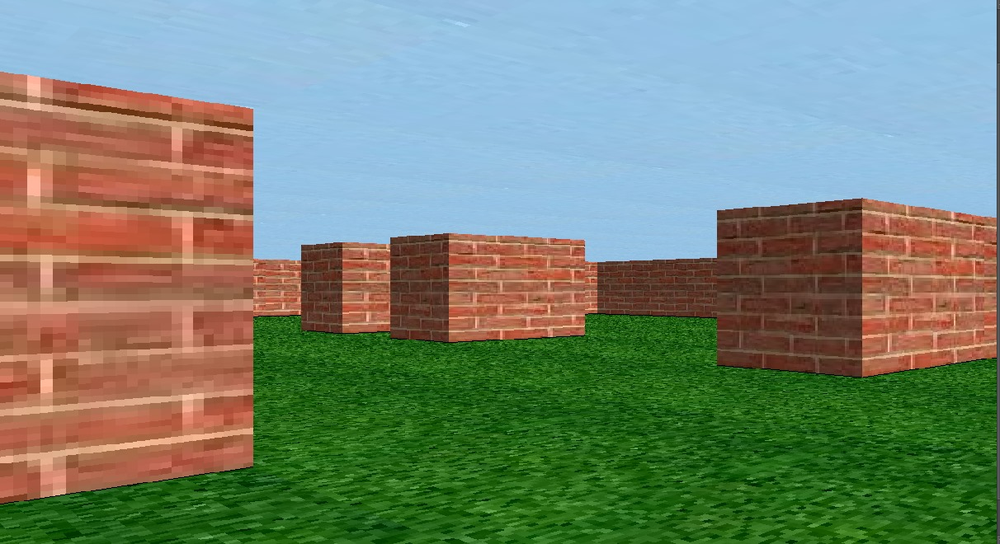

# *Project Name: The Maze*

*_This repository contains code for the Maze Project, done as the Foundations' final project in the ALX Software Engineering_*

 

 

# *Introduction*
The project explores how to create a realistic 3D maze using raycasting.

To read my blog post visit: [LinkedIn](https://www.linkedin.com/pulse/maze-journey-3d-game-development-dad-mohammed-bp1oe/?trackingId=d2fM42NIQe299Z%2BpPhDzfA%3D%3D)

## *How to Compile and Run this Maze*
*Note:* To compile this program, ensure that libsdl2 is installed on the system  
If libsdl2 is not installed, on Ubuntu run

>  sudo apt-get install libsdl2-dev 

To compile the program type these commands on the terminal

>  git clone https://github.com/DadMed/The_Maze.git  
>  cd alx-maze_project  
>  gcc src/*.c -Wall -Werror -Wextra -pedantic -lm -lSDL2main -lSDL2 -lSDL2_image -o maze  

or alternatively, run

>  make 

To run this program  

>  ./maze map_name

Where map_name is a file name for any text file located in the "maps" directory

Example Usage:

>./maze default

To enable textures run

> ./maze map_name textured 

where map_name is a map file

To disable textures run

>  ./maze map_name no-textures 

Note: *By default, maze is rendered with the textures enabled.*

For help on how to run the maze run  
>./maze help 

or

> ./maze map_name help 

## *Maze Controls*
Use the following keys to control movement in the maze: 
> W or up arrow key - moving forward  
> S or down arrow key - moving backward  
> A or left arrow key - turning left  
> D or right arrow key - turning right  
> R - strafe right  
> L - strafe left  

# *Contributing*
All developers are encouraged to contribute and improve this project.  

# *My Story*
This project has greatly enhanced my software development skills, proving that expertise grows under pressure. Rigorous practice in designing, building, and debugging is essential for becoming a top developer.

Balancing work and personal life was a major challenge due to the project's complexity and long hours. Effective time management and prioritization were crucial to avoid burnout and maintain productivity.

Recognizing the need for relaxation and mental rejuvenation helped maintain focus and creativity during intensive coding sessions. This experience emphasized resilience, adaptability, and self-care in achieving professional excellence.

## To-Do
* make wepons and enemies
* improve map parsing
* include more textures
* add options such as help, e.t.c
* add enemies, obstacles, e.t.c

## Resources
> * [SDL2 API](https://wiki.libsdl.org/CategoryAPI)  
> * [LazyFoo Beginning Game Programming](http://lazyfoo.net/tutorials/SDL/index.php)  
> * [Ray-Casting Tutorial For Game Development And Other Purposes by F. Permadi](http://permadi.com/1996/05/ray-casting-tutorial-table-of-contents/)  
> * [LodeV Raycasting Tutorial](http://lodev.org/cgtutor/raycasting.html)  
> * [Game Engine Black Book](https://www.amazon.com/Game-Engine-Black-Book-Wolfenstein/dp/1539692876)  

